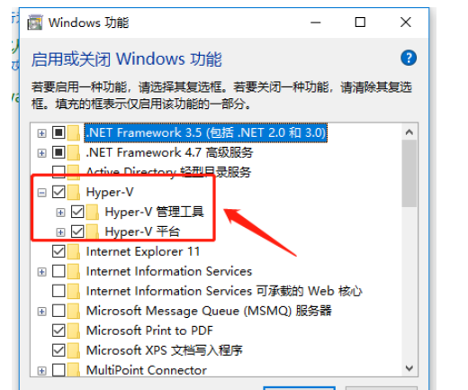
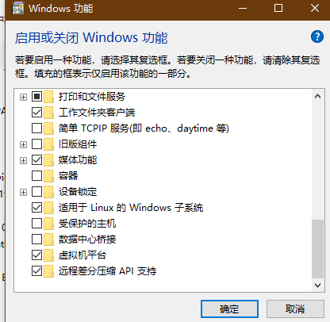
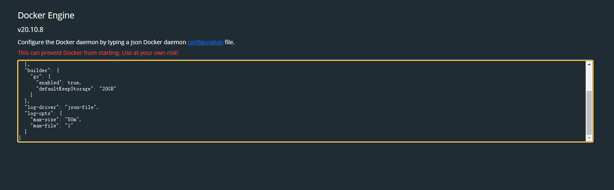

# Docker使用记录

- [Docker使用记录](#docker使用记录)
  - [Docker安装](#docker安装)
    - [window10下安装(WSL2)](#window10下安装wsl2)
      - [1.电脑虚化配置（Bios内配置Virualization Technology，不同主板有不通配置）](#1电脑虚化配置bios内配置virualization-technology不同主板有不通配置)
      - [2.安装wsl2](#2安装wsl2)
      - [3.设置Hyper-V、适用于Linux的Windows子系统](#3设置hyper-v适用于linux的windows子系统)
      - [4.移动安装的文件到其他目录](#4移动安装的文件到其他目录)
  - [Docker使用](#docker使用)
    - [常用命令](#常用命令)
    - [全局设置](#全局设置)
  - [附录](#附录)

## Docker安装
### window10下安装(WSL2)
#### 1.电脑虚化配置（Bios内配置Virualization Technology，不同主板有不通配置）

#### 2.安装wsl2
* [wsl](./../wsl/readme.md)

#### 3.设置Hyper-V、适用于Linux的Windows子系统
* 进入控制面板，选择程序，选择启用或关闭Windows功能

* 下载[Docker](https://store.docker.com/search?type=edition&offering=community)，并安装（适合Windows10专业版、企业版），安装时选择WSL2

#### 4.移动安装的文件到其他目录
* 关闭docker
* 关闭wsl: 
> wsl --shutdown  
* 将docker-desktop-data导出到D:\xxx\wsl\docker-desktop-data.tar（注意，原有的docker images不会一起导出）
> wsl --export docker-desktop-data D:\xxx\wsl\docker-desktop-data.tar  
* 注销docker-desktop-data：
> wsl --unregister docker-desktop-data  
* 重新导入docker-desktop-data到要存放的文件夹：D:\xxx\wsl\docker-desktop-data\：
> wsl --import docker-desktop-data D:\xxx\wsl\docker-desktop-data\D:\xxx\wsl\docker-desktop-data\docker-desktop-data.tar --version 2  

## Docker使用
### 常用命令
* docker image
* docker ps -a 
### 全局设置
* 限制日志大小 ，参考代码 ：

* 修改之前的容器都不支持该功能

## 附录
* [win10使用wsl2安装docker，与路径迁移](https://www.cnblogs.com/xhznl/p/13184398.html)
* [文件导入导出1](https://www.cnblogs.com/yoyoketang/p/12131002.html)
