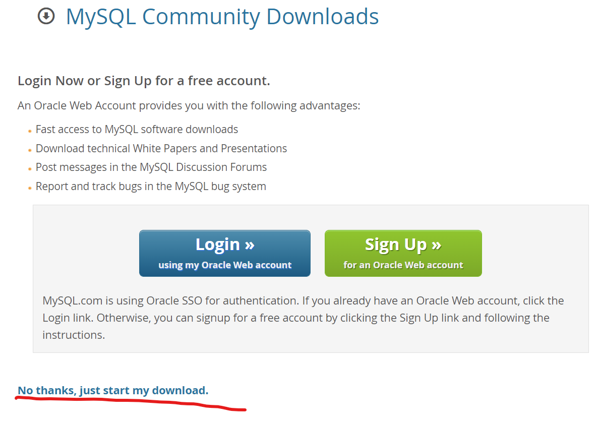

# Mysql

- [Mysql](#mysql)
  - [安装](#安装)
    - [ubuntu平台](#ubuntu平台)
  - [使用](#使用)
    - [mysql的控制指令](#mysql的控制指令)
    - [mysql的操作指令](#mysql的操作指令)
  - [附录](#附录)

## 安装
### ubuntu平台
* 更新仓库`sudo apt update`
* 安装mysql`sudo apt install mysql-server -y`
**使用官方仓库安装mysql**  
* 在[官网地址](https://dev.mysql.com/downloads/repo/apt/)中复制下载地址

* 使用curl下载`curl -OL https://dev.mysql.com/get/mysql-apt-config_0.8.12-1_all.deb`
* 使用dpkg安装MySql `sudo dpkg -i mysql-apt-config*`
* 更新仓库`sudo apt update`
* 安装时会弹出提示信息，包括设置初始root密码，根据提示完成后及完成安装
* 验证已正确安装`sudo systemctl status mysql.service`

## 使用
### mysql的控制指令
**service**  
* 启动`service mysql start`
* 关闭`service mysql stop`
* 重启`service mysql restart`  
* 状态`service mysql status`
**systemctl*** 
* 启动`systemctl start mysql.service`
* 关闭`systemctl stop mysql.service`
* 重启`systemctl restart mysql.service`
* 状态`sudo systemctl status mysql.service`
* 开机时启动`sudo systemctl enable mysql.service`
* 开机时禁用`sudo systemctl disable mysql.service`

### mysql的操作指令
* 登录`myslq -u root -p`
* 新建数据库test`creat database test;`
* 删除数据库test`drop database test;`
* 查看数据库`show databases;`

## 附录
* [安装mysql](https://zhuanlan.zhihu.com/p/64080934)
* [Linux下新建一个MySQL数据库](https://blog.csdn.net/baishuiniyaonulia/article/details/80022671)
* [systemctl命令](https://blog.csdn.net/zouzh/article/details/111119993)
