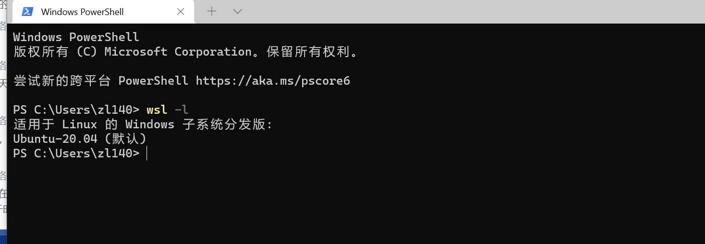

# WSL

- [WSL](#wsl)
  - [介绍](#介绍)
    - [wsl1与wsl2的区别](#wsl1与wsl2的区别)
  - [安装](#安装)
    - [必要配置](#必要配置)
    - [安装系统](#安装系统)
    - [安装完成](#安装完成)
    - [切换版本到WSL2](#切换版本到wsl2)
    - [移动到其他盘](#移动到其他盘)
  - [使用](#使用)
  - [附录](#附录)
    - [WSL文档](#wsl文档)

## 介绍
* [wsl](WSL（Windows Subsystem for Linux）详细介绍见官网：https://docs.microsoft.com/en-au/windows/wsl/about)
### wsl1与wsl2的区别
* 相比于 WSL1，WSL2 通过虚拟机的方式带来了更完整的 Linux 内核，但这种方式也引入了一些问题，微软给出了下面的图表来展示这些不同：

## 安装
### 必要配置
* 1.打开控制面板中的程序和功能，打开启用或关闭Windows功能  

* 2.向下拉 勾选适用于Linux的Windows子系统，确定  

### 安装系统
* 3.打开win10带的Microsoft Store 搜索 LINUX，并安装  

* 4.安装完毕启动应用，初次启动会要求键入用户名和密码，根据需求输入即可，这样就算是安装完成  
### 安装完成 
* 打开PowerShell
* 输入 **wsl -l** 命令查看安装信息

### 切换版本到WSL2
* 需要windows10版本在2004或以上
* 使用管理员打开PowerShell
* 启用“虚拟机平台”可选组件  
> dism.exe /online /enable-feature /featurename:VirtualMachinePlatform /all /norestart
* 或直接使用控制面板->程序->启用或关闭Window功能->勾选Hyper_v

* 重启电脑
* 重启后，再次使用管理员打开PowerShell，然后使用命令将wsl设置为wsl2
> wsl --set-default-version 2

### 移动到其他盘
* 下载工具[LxRunOffline](https://github.com/DDoSolitary/LxRunOffline/releases)
* 在解压路径打开PowerShell控制台(shift+鼠标右键，然后选择PowerShell)
* 关闭`wsl wsl --shutdown`
* 使用`.\LxRunOffline.exe list`查看子系统名称

* 使用 `lxrunoffline move`工具进行迁移 ， -n 指定你要迁移的系统名 ，-d 指定你新系统的迁移路径 `.\LxRunOffline.exe move -n Ubuntu-20.04 -d I:\Ubuntu-20.04`

* 查看当前目录`.\LxRunOffline.exe get-dir -n Ubuntu-20.04`

## 使用

## 附录
* [window10使用wsl2运行Docker Desktop](https://www.cnblogs.com/xhznl/p/13184398.html)
* [window10安装linux（WSL）与迁移到非系统盘](https://blog.csdn.net/tonydz0523/article/details/103443768)
* [wsl2安装](https://blog.csdn.net/huiruwei1020/article/details/107551106)
### WSL文档
* [用于限制wsl的性能](https://docs.microsoft.com/en-us/windows/wsl/release-notes#build-18945)
* [设置wsl版本为wsl2](https://docs.microsoft.com/en-us/windows/wsl/install-manual#step-4---download-the-linux-kernel-update-package)
